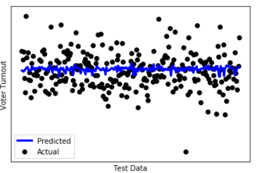
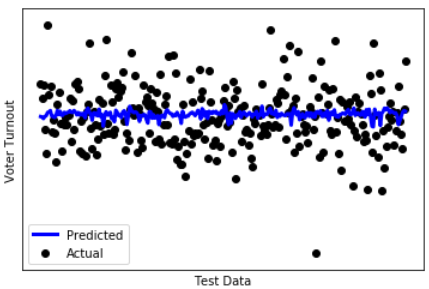
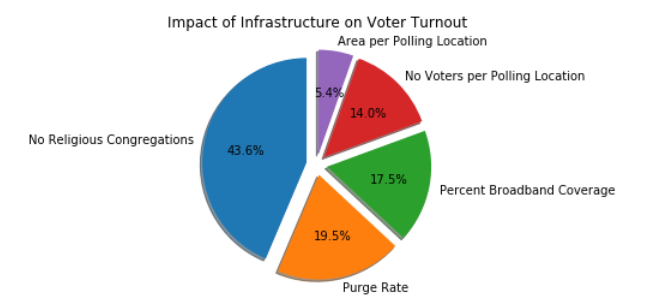
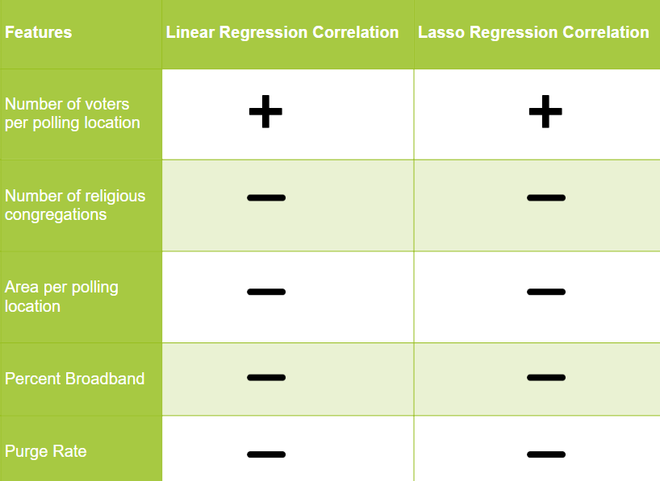

### Predicting Voter Turnout

Last fall, 2018, the State of Georgia experienced a divisive gubernatorial election between Stacey Abrams and Brian Kemp fraught with explicit and systematic voter suppression [[1]](https://www.nytimes.com/2019/03/06/us/politics/governor-brian-kemp-voter-suppression.html?partner=IFTTT). The tactics employed by Brian Kemp and republican operatives included exact-match purging of voters from rolls and premature closure of polling locations. These tactics saw $85,000$ voters removed from the rolls in the three months leading up to the election and $667,000$ removed during 2017 [2]. All told, more than 10% of eligible, primarily black, voters were removed from the rolls [2]. The systematic and widespread suppression netted Brian Kemp a victory while inspiring the Fair Fight movement. In the spirit of Fair Fight, this project endeavors to predict voter turnout using machine learning techniques based on district-level infrastructure data.

### Dataset
<!---
-->

We built a per-state election policy dataset using policy information obtained from [NCSL](http://www.ncsl.org/). In particular, we included the following features:

1. No excuse early voting
2. All mail voting
3. Poll Station Closing Time 
4. Automatic restoration of voting rights upon release from prison
5. Same day registration
6. Civics Course Requirement
7. Online Registration
8. Vote centers 
9. No excuse absentee voting
10. Automatic Voter Registration
11. Pre-registration for young voters
12. Voter ID required

Labels: State Voter Turnout Percentage 2018

 

We further built a per-county election infrastructure dataset which included the following features:

1. No Voters per Polling Location
2. No Religious Congregations
3. Area per Polling Location
4. Percent Broadband Coverage
5. Purge Rate

Labels: County Voter Turnout Percentage 2018

<!----->

### Unsupervised Learning

We performed clustering on the state-wise voter turnout dataset across two dimensions: first we merged together similar features using FeatureAgglomeration for dimensionality reduction; next, we clustered together similar states based on election policy using k-means.

#### K-means

We employed the elbow method to determine the ideal number of clusters and then performed k-means on the state voter-turnout dataset to group together states with similar election policies:

Ideal number of clusters using elbow method = 3.

| Cluster | Mean voter turnout|
|---------|-------------------|
|    0    |       0.520       |
|    1    |       0.498       |
|    2    |       0.528       |

Silhouette Score for K-Means (higher is better) = 0.538.

#### Feature Extraction

Further, to determine which policies have the most impact on voter turnout, we performed Feature Extraction using the SelectKBest method which outputs the K features with the highest scores.

### Supervised Learning

We used the per-county election infrastructure dataset to perform linear and lasso regression to predict voter turnout. Lasso regression is used to reduce model complexity and prevent over-fitting which may result from simple linear regression.

Lasso regression puts constraints on the coefficients (w). A penalty term (lambda) regularizes the coefficients such that if the coefficients take large values, the optimization function is penalized. So, lasso regression shrinks the coefficients and helps reduce the model complexity and multi-collinearity. In addition, Lasso uses regularization (L1) that can lead to zero coefficients i.e. some of the features are completely eliminated. So Lasso regression not only helps in reducing over-fitting but it can help us in feature selection.

#### LINEAR REGRESSION

Accuracy of the linear regression model:

| Training score | Test score:  |
|----------------|--------------|
|    0.01477     |   0.01419    | 

Predicted vs Actual Voter Turnout:

#### LASSO REGRESSION

Accuracy of the lasso regression model using varying lambda values:

|     Lambda     | Training score|  Test score    |# Features used|
|:--------------:|:-------------:|:--------------:|:-------------:| 
|     0.001      |   0.0138      |    0.01047     |        5      |
|    0.0001      |   0.0138      |    0.01047     |        5      |
|    0.00001     |   0.0144      |    0.01185     |        5      |

Best Lambda = 0.00001

Predicted vs Actual Voter Turnout:

#### Feature Extraction

We further used SelectKBest to determine the impact of each of the infrastructure features on voter turnout rate:

<!---Correlation between voter turnout and the different features:
-->

<!---We have a positive correlation between the number of voters assigned to a polling location and the voter turnout. Other features, while significant, are negatively correlated with voter turnout per our trained model.-->

### Related Work and Conclusion
Keeter et al. predicted voter turnout based on interviews, voter history, and demographics using random forest and logistic regression [3]. Challenor predicted voter turnout using labor force demographics in [4]. Unlike past work that focuses on immutable population characteristics such as demographic information, we predict voter turnout based on state election policy as well as local election infrastructure, including but not limited to distance from polling stations, as examined by [5].

Studying the impact of election policy and infrastructure on voter turnout may yield information that will help policy makers make better policy and budgeting decisions to improve voter turnout and help identify and prevent policy and infrastructure changes that result in voter suppression.

### References
[1]  M. Astor, “Georgia governor brian kemp faces investigation by house panel,” 2019.

[2]  K. Shah, “Textbook voter suppression:  Georgia’s bitter election a battle years in the making,”TheGuardian, 2018.

[3]  S. Keeter, R. Igielnik, and R. Weisel, “Can likely voter models be improved?”Pew Research Center,2016.

[4]  T. Challenor, “Predicting votes from census data,” 2017.

[5]  M.  Haspel  and  H.  G.  Knotts,  “Location,  location,  location:   Precinct  placement  and  the  costs  ofvoting,”The Journal of Politics, 2005.
