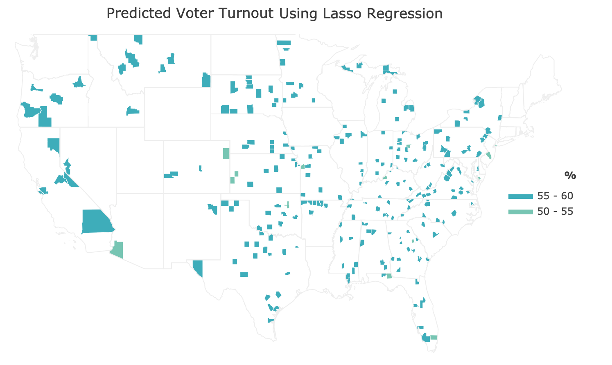
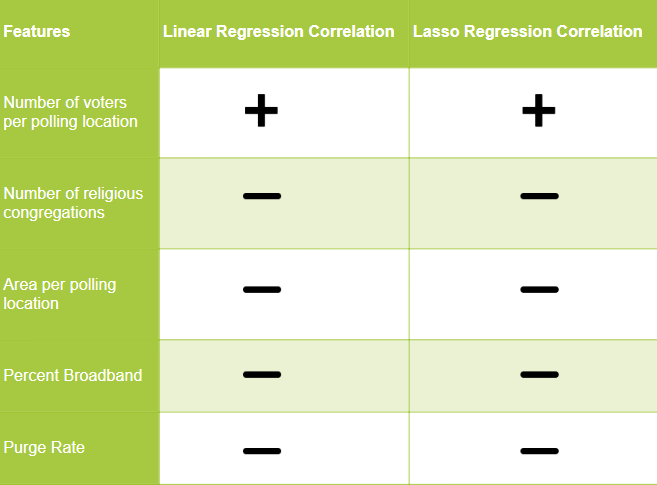

### Predicting Voter Turnout

Last fall, 2018, the State of Georgia experienced a divisive gubernatorial election between Stacey Abrams and Brian Kemp fraught with explicit and systematic voter suppression [[1]](https://www.nytimes.com/2019/03/06/us/politics/governor-brian-kemp-voter-suppression.html?partner=IFTTT). The tactics employed by Brian Kemp and republican operatives included exact-match purging of voters from rolls and premature closure of polling locations. These tactics saw $85,000$ voters removed from the rolls in the three months leading up to the election and $667,000$ removed during 2017 [[]](). All told, more than 10% of eligible, primarily black, voters were removed from the rolls [[]](). The systematic and widespread suppression netted Brian Kemp a victory while inspiring the Fair Fight movement. In the spirit of Fair Fight, this project endeavors to predict voter turnout using machine learning techniques based on district-level infrastructure data.

### Dataset

Description to be added
  
 

{height="500px" width="400px"}

### Unsupervised Learning

#### K-means

We performed K-means clustering on the state election policy dataset and employed the elbow method to determine the ideal number of clusters:

Ideal number of clusters = 3.

Silhouette Score (higher is better) = 0.538

#### Feature Extraction

Further, to determine which policies have the most impact on voter turnout, we performed Feature Extraction using the SelectKBest method which outputs the K features with the highest scores.

### Supervised Learning

We used the county election infrastructure dataset to perform linear and lasso regression to predict voter turnout.
Lasso regression is used to reduce model complexity and prevent over-fitting which may result from simple linear regression.

So lasoo regression puts constraint on the coefficients (w). A penalty term (lambda) regularizes the coefficients such that if the coefficients take large values the optimization function is penalized. So, lasso regression shrinks the coefficients and it helps to reduce the model complexity and multi-collinearity. In addition, Lasso uses regularization (L1) that can lead to zero coefficients i.e. some of the features are completely neglected for the evaluation of output. So Lasso regression not only helps in reducing over-fitting but it can help us in feature selection.

The following plots show linear regression results:

LR training score: 0.01477
LR testing score: 0.00256

{:height="500px" width="500px"}
{:height="500px" width="500px"}

**Insert visualization for lasso regression **Insert score for lasso regression

training score: 0.01419
test score:  -0.000626
number of features used:  5
training score for alpha=0.001: 0.01419
number of features used: for alpha =0.001: 5
training score for alpha=0.0001: 0.01474
number of features used: for alpha =0.0001: 5
LR training score: 0.01474

{:height="500px" width="500px"}
{:height="500px" width="500px"}

Feature Extraction for county level dataset reveals 

Correlation between voter turnout and the different features in the dataset indicates:
{:height="300px" width="250px"}

We have a positive correlation between the number of voters assigned to a polling location and the voter turnout. Other features, while significant, are negetively correlated with voter turnout per our trained model.

### Related Work
Keeter et al. predicted voter turnout based on interviews, voter history, and demographics using random forest and logistic regression [[]](). Challenor predicted voter turnout using labor force demographics in [[]](). Unlike their work, we propose to predict voter turnout based on local infrastructure, including but not limited to distance from polling stations, as examined by [[]]().

### References
[1]  M. Astor, “Georgia governor brian kemp faces investigation by house panel,” 2019.

[2]  K. Shah, “Textbook voter suppression:  Georgia’s bitter election a battle years in the making,”TheGuardian, 2018.

[3]  S. Keeter, R. Igielnik, and R. Weisel, “Can likely voter models be improved?”Pew Research Center,2016.

[4]  T. Challenor, “Predicting votes from census data,” 2017.

[5]  M.  Haspel  and  H.  G.  Knotts,  “Location,  location,  location:   Precinct  placement  and  the  costs  ofvoting,”The Journal of Politics, 2005.
